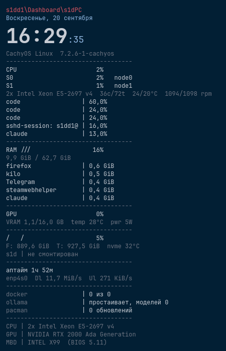

# plaintop

English · [Русский](README.ru.md)

A text system monitor for the KDE Plasma desktop: monospaced text drawn straight onto the
wallpaper — load bars made of slashes, process tops, no frames, no rounded corners.

The look comes from the Rainmeter skin
[PlainExt](https://vsthemes.org/en/skins/rainmeter/41409-plainext.html); the name is
*plain* from there plus *top* from `htop`/`btop`.



## What it shows

Clock, date, distro and kernel, total CPU load and load per NUMA node, CPU model with
per-node temperatures and fan speeds, the kernel's pressure stall information for CPU,
memory and I/O, load averages, top processes by CPU and by memory, RAM and swap, every
GPU with VRAM, temperature and power draw, filesystems with NVMe temperature and disk I/O,
uptime, network throughput with the address, the totals and the Wi-Fi signal if asked,
the battery when the machine has one and the batteries of the mice and headsets around
it, the state of docker / podman / libvirt / ollama / pending updates (pacman, apt, dnf,
zypper, flatpak), the systemd units you name, any temperature sensors you pick, the sound
output's volume, your git repositories, system health — failed systemd units, errors
since boot, a pending reboot, the last error lines of the journal — a static hardware
passport, and lines of your own. A bar past its threshold turns red; a bar can carry a
sparkline of its last readings; blocks can go into a second column. The lines are active:
a click on a bar opens System Monitor, on a disk its folder, on a unit its status, on a
process a question before it is ended; the right button lists what a line can do.

Which of those appear, in what order, and with what parameters is **data, not code** —
see [Three layers](#three-layers) below.

## Status

Built and used on one machine: CachyOS, Plasma 6.7.5, KWin on Wayland. It should work on
any Plasma 6 desktop, but nothing else has been tested — reports welcome.

Devlog: [t.me/s1dd1_logs](https://t.me/s1dd1_logs) — the author's Telegram channel.

What is in the repository:

| Directory | What it is | State |
|---|---|---|
| **`monitor/`** | the text monitor: a plasmoid, with the renderer and data side in `shared/`; the retired window host stays in `window/` (decision 9) | works |
| **`spectrum/`** | the audio visualizer: a widget plus a relay service that serves cava's bands | works |
| **`player/`** | the "now playing" widget: track, position bar and controls as text, read from MPRIS through Plasma's media controller module; its view lives in `shared/`, since the visualizer draws it too | works |
| **`weather/`** | the weather widget: now and the next days as text, from one of four sources over https — Open-Meteo by default — no service of its own | works |
| **`calendar/`** | the calendar widget: a wall calendar's page as text — one month or three, week numbers, the weekends and today marked — everything from the locale, no service | works |
| **`conky/`** | the first implementation on [conky](https://github.com/brndnmtthws/conky) | switched off, kept until the plasmoid fully replaces it |

⚠️ **About the mouse.** The *Mouse* setting lets both buttons through to the desktop: the
plasmoid disables the wrapper the shell puts around it, so clicks land on the icons and the
wallpaper as if the widget were not there. The widget takes the mouse only in the desktop's
edit mode — which is also where its settings are. One exception, where there is something
to click: the player's controls row `<<  >  >>` — in the player widget and in the
visualizer with the player in its ring — keeps taking clicks while everything around it
lets them through (decision 11). How the left button was won back, after four failed
attempts: [docs/GOTCHAS.md](docs/GOTCHAS.md). Before the plasmoid could do
this, each widget had a **window host** — a plain window with `Qt.WindowTransparentForInput`.
Those hosts are retired (decision 9): one host now, the plasmoid, with Plasma's own
settings dialog. Their code stays in the tree but is not installed;
`./install.sh --windows-off` retires an existing setup.

Why the engine changed: [docs/DECISIONS.md](docs/DECISIONS.md).

## Install

**From the KDE Store** — in Plasma *Add Widgets… → Get New Widgets… → Download New Plasma
Widgets*, search for the name:

- the monitor, `plaintop` — [store.kde.org/p/2372814](https://store.kde.org/p/2372814/), no
  repository needed;
- the visualizer, `plainspectrum` — [store.kde.org/p/2372815](https://store.kde.org/p/2372815/);
  it draws nothing until the relay below is installed;
- the player, `plainplayer` — [store.kde.org/p/2373633](https://store.kde.org/p/2373633/);
- the weather, `plainweather` — [store.kde.org/p/2373634](https://store.kde.org/p/2373634/);
- the calendar, `plaincalendar` — [store.kde.org/p/2377077](https://store.kde.org/p/2377077/).

**From the repository** — all five widgets and the relay:

```bash
git clone https://github.com/highscrren-dotcom/plaintop.git
cd plaintop
./install.sh --plasmoid          # the monitor: generate, install, restart the shell
./install.sh --spectrum          # the audio visualizer: plasmoid + relay service
./install.sh --player            # the "now playing" widget: plasmoid only
./install.sh --weather           # the weather widget: plasmoid only
./install.sh --calendar         # the calendar widget: plasmoid only
./install.sh --windows-off       # retire the window hosts of an earlier setup (decision 9)
./install.sh --status            # what is installed and what is running
```

The plasmoid lands in `~/.local/share/plasma/plasmoids/org.s1dd1.plaintop/`; the installer
places it on the desktop (it holds off only while a not-yet-retired window host is still
set up — run `--windows-off` first), and *Add Widgets* works as usual.
`./install.sh --pack` builds the same packages as `.plasmoid` files into `dist/`, for the
KDE Store or a release.

⚠️ `--plasmoid` restarts `plasmashell` on purpose: the shell caches a package's QML, and
without a restart your edit silently does not arrive. That and a dozen other traps are in
[docs/GOTCHAS.md](docs/GOTCHAS.md).

The conky implementation has its own switches: `./install.sh` deploys and starts it,
`--conky-files` deploys without starting (useful while it is switched off),
`--conky-off` and `--conky-on` turn it off and back on.

**Requirements:** Plasma 6 with `ksystemstats` (ships with Plasma) and KDE Frameworks
6.23 or newer (for `KI18nContext`, decision 7), `python3` for the generator, the setup
scripts and the relay, `msgfmt` from gettext for the translations, and a monospace font —
`JetBrainsMono Nerd Font Mono` by default (`qt6-declarative` only for the click-through
stand, `--check-passthrough`). The visualizer additionally needs `cava`; the player nothing
extra — the MPRIS module it reads ships with plasma-workspace; the weather needs network
access to the chosen source's host (`api.open-meteo.com` by default) and to
`geocoding-api.open-meteo.com` for the place search; the calendar nothing beyond Plasma; the
conky implementation needs
`conky`, `python-xlib` and `lm_sensors`.

## Adapting it to your hardware

Nothing about the author's machine is baked into the layout. Hardware-specific values are
found on the machine the widget runs on:

| What | How it is chosen | Change it in |
|---|---|---|
| Network interface | among the connected hardware interfaces: the one with a gateway, then the one that carried the most traffic | settings → *Blocks* → *Network*, the interface parameter; empty means "find it" |
| Fan and NVMe sensors | by pattern among the sensors this machine reports | settings → *Blocks* → *Processor* / *Disks*, the sensor parameters; empty means "by pattern" |
| Mount points | `/` only — a mount point is a choice, not something to guess | settings → *Blocks* → *Disks*, the mount list |
| Header text | yours to write; empty by default, so only the hostname shows | settings → *Blocks* → *Header* |

The retired window editor offered these as pick lists with live values; the plasmoid's
dialog takes a typed value or an empty one, and discovery does the rest (decision 6).

A value you pick is kept as a preference: while the machine still reports it, it wins; when
a reboot renames the chip or the interface, the widget falls back to discovery instead of
going quiet. Decision 6 in `docs/DECISIONS.md` explains why.

⚠️ If you ever write a sensor id by hand, address `lm_sensors` chips **by name**
(`nct6779-isa-0a20`), never by `hwmon` index — indexes move between reboots.

## The audio visualizer

`spectrum/` draws the spectrum of whatever is playing — a ring, an arc or a line of ticks,
in the same flat style. `cava` does the spectrum, a small systemd user service serves its
bands over local HTTP, and the widget moves ready-made rectangles: the GPU stays at about
half a percent because nothing is rasterized per frame.

Since 0.3 it can also carry the player: the *Player* page puts the "now playing" view —
the same file the player widget draws, `player/shared/PlayerView.qml` — in the centre of
the ring, or along the edge the bars reach last on a line; the ring keeps its size, and
with no player on the bus the centre stays empty. Off by default (decision 12). With the
*Mouse* setting on, only that player's controls row `<<  >  >>` takes clicks; the rest of
the widget lets them through.

It is a plasmoid with Plasma's settings dialog; its earlier click-through window host is
retired (decision 9). Details, settings and the measured cost:
**[spectrum/README.md](spectrum/README.md)**.

## The player

`player/` shows what is playing, in the same monospace lines as the monitor: the player's
name, artist and title, the album, a slash bar with the position and time, and `<<  >  >>`
controls — plain text with a mouse area under each glyph, no buttons. It reads MPRIS through
the module behind Plasma's own media controller, so whatever Plasma sees, it sees: VLC,
Spotify, a browser. The *Player* setting pins it to one player by name; empty means whoever
is playing. Its *Mouse* setting lets everything through except the controls row: a click
on `<<`, `>` or `>>` reaches the button, a click anywhere else on the widget lands on the
desktop or the widget beneath, and so does the hover (decision 11 — proven on the
click-through stand against the shell's compiled applet wrapper; a real mouse on a live
desktop is still the check to make). The same view can sit in the centre of the
visualizer's ring, as an option there; the widget stays a product of its own
(decision 12). `./install.sh --player` installs it.

## The weather

`weather/` shows the weather in the same lines: a header with the place, the current
conditions — temperature, a word for the sky, what it feels like, wind and humidity — and
one row per forecast day with the low, the high, the sky and the chance of rain where the
source gives it. Left of the current line and the day rows there is a picture of the sky
made of characters — a sun with rays, a cloud, rain as the same slashes the monitor's bars
are made of, snow, fog, a bolt; twelve pictures by WMO code group, 48 by 24 characters of
the widget's own font at three pixels each, so it is text like the rest of the widget. The
*Icon* setting on the *General* page turns it off or sets the size, 3 to 5 px. The data
comes from one of four sources, chosen on the *Location* page:
[Open-Meteo](https://open-meteo.com) (the default) and [MET Norway](https://api.met.no)
need no key; [WeatherAPI.com](https://www.weatherapi.com) and
[Visual Crossing](https://www.visualcrossing.com) take a free key from your own account,
pasted into the settings. Four rather than one because a single host can be unreachable
from some networks while another answers (decision 13). Whatever the source, the widget
fetches it itself over https every 15 minutes (30 for Visual Crossing), maps its condition
codes to one table of words and keeps the last answer in the config, so it is drawn before
the next one arrives and stays through an outage: the header says `· offline`, after an
hour with the age of what is shown, and the rows under it are the last forecast that
arrived, not blanks; a key the source refuses says `· bad key`. The place comes from a
search on the *Location* page, or two typed coordinates; until one is set the widget
guesses the city from the time zone and says so in the header. It never asks a
geolocation service where you are: behind a tunnel that would be the tunnel's exit
(decision 10). Units follow the locale, or are chosen by hand. Every source's terms ask
for attribution — the last line names the source in use, on by default.
`./install.sh --weather` installs it.

## The calendar

`calendar/` is a wall calendar in the same lines: the month's name and year, a row of
weekday names, and the days in a grid of seven columns with the ISO week number in front
of every row — one month, or three one under another, the previous, the current and the
next, as the quarterly calendars on an office wall. Weekends take the accent colour, the
red of a printed calendar; today is in brackets in a colour of its own, the ring on the
wall. Everything the grid says comes from the locale — the names, the first day of the
week, which days are the weekend — so it reads as the calendar on your wall does, in your
language; the first day can be forced to Monday or Sunday, and the empty cells can be
filled with the neighbouring months' days. The widget is as wide as seven cells and the
week numbers and as tall as the months shown, eight lines each with a blank line between,
so its size holds whatever month it is. `./install.sh --calendar` installs it.

**Notes and calendars.** A day with an entry takes a colour of its own, and a click on
it — the cell is framed under the pointer — opens a sticker: a sheet framed with
characters (`┌─┐│└┘`, or `+-+|` if you prefer ASCII) in the widget's font, with the day's
events and tasks grouped by account, read-only, and your notes under them — as many a
day as you like: a click on one puts it in the editor, "+ new note" starts another; the
first line is a note's title; Esc closes, an emptied note is deleted; it fades in or unfolds
line by line. The next few entries are printed under the months. Your notes are all-day
events in iCalendar: by default files in `~/.local/share/plaincalendar/notes/` (a vdir
any sync tool can read), or, chosen on the *Notes* page, an account's calendar. The
accounts, as many as you have and none by default, are set up on the *Accounts* page
over one protocol, CalDAV: Yandex and iCloud with an app password, Google with its
OAuth login run once in a terminal, any other CalDAV server, and read-only ICS links.
The widget never talks to a server itself: `contents/code/notes.py` does — discovery,
calendar-query, PUT and DELETE with etags, recurrence rules, the time zones — and keeps
the passwords in its own file, mode 600. `./install.sh --check-notes` runs its stand,
a fake CalDAV server included.

**Reminders.** Under the note the sticker has two rows: *time* — type `14:30`, or leave
it empty for an all-day note — and *remind*, where a click picks when it rings: none, a few
minutes before (ten by default) or an hour before a timed note; none or at the hour you set
(09:00) for an all-day one. The same can be typed into the note: a first line that starts
with a time — `14:30 Dentist`, or `9.00-10.30 Standup` — makes a timed event that rings
before it, `!Buy milk` an all-day note that rings at the hour. Both are VALARMs in the iCalendar the note is saved as, so an account's phone
rings too; the accounts' own events ring by their alarms, and timed ones without any by
the same lead if you ask. When one is due, a sheet in the same frame opens from the day's
cell — the entry, its account, and the ways out marked with `>`: snooze a few minutes, an
hour, tomorrow at the hour, done, and for a task "task done", which completes it on its
server. The sheet does not take the keyboard from what you are typing. Alarms missed while
the machine was off come one after another, headed MISSED, up to a few hours back; with
two instances of the widget, the one that claims an alarm first shows it. Acknowledgements
and snoozes stay local, in `~/.cache/plaincalendar/reminders.json`. Optionally a system
notification through `notify-send` and a sound — five short plain tones of the widget's own
(bell, blip, chime, pager, tick; made by `calendar/sounds.py`) or a file of yours, with a
*Listen* button. Everything is on the *Notes* page.

## Three layers

```
schema/widget.json  ─┐                                    ┌─ settings dialog edits it
                     ├─ generator ─→ engine (QML)         │
schema/blocks.json  ─┘                                    └─ or edit the JSON directly
```

- **Description** — `schema/widget.json`: which blocks, in what order, with what
  parameters. Says *what* to show, not *how* to write it, so it does not depend on the
  engine.
- **Vocabulary** — `schema/blocks.json`: the block types and the parameters each accepts.
  The settings dialog is built from it, so a new block type needs no interface code.
- **Generator** — `monitor/generate.py`: validates the description and turns it into a JS
  module inside the package. A bad description stops the install instead of producing an
  empty widget.

Details: [schema/README.md](schema/README.md).

## Settings

Right-click the widget → *Configure plaintop…*. Two pages:

- *General* — font, size, edge padding, widget size, the four palette colours, the bars'
  width and characters, the separator, the sparkline glyphs, where the second column
  starts, the mouse and the active lines with the terminal and editor they use and the
  menu's frame and paper, update interval, how often the process list is read.
- *Blocks* — enable, disable, reorder, edit parameters, add a block of any type
  from the vocabulary, duplicate or remove one, name it, send it to the second column,
  switch its lines' clicks off or give them a command of your own, pick sensors,
  interfaces and mount points from what the machine has, or edit the whole layout as JSON.

That dialog is the only editor. The window hosts' own editors with a live preview
(`window/settings.qml` in each widget) retired with them (decision 9);
`./install.sh --plaintop-settings` / `--spectrum-settings` are not to be used.

**Active lines.** A line that has something to do takes clicks: a left click runs its
first action, a right click lists them all in a menu framed with characters, in the
widget's own font and colours; the line under the pointer gets a one-pixel frame.
Bars open System Monitor; a disk opens its folder, or a terminal there; a systemd unit
shows its status, starts, stops, restarts, or opens its journal; a process is terminated or
killed after a question; the updates line runs the package manager in a terminal; the
sound line toggles mute; a repository opens a terminal, the file manager, the editor or
pulls; the uptime line locks the screen, logs out, reboots or powers off, each but the
lock after a question; the header opens the settings — handy while clicks pass through.
Terminal programs run detached in the terminal from *General* (`konsole -e` by default),
held open where there is output to read. On the *Blocks* page a block's lines can be
switched off (*Active*) or given a command of your own (*Click*), with `{name}`, `{pid}`,
`{path}`, `{unit}` and `{value}` filled in from the row; the *Active lines* switch on
*General* turns the whole thing off.

**About the mouse.** Out of the box the plasmoid takes clicks like any widget, so a
right-click reaches its settings. The *Mouse* setting — and the
`./install.sh --clicks-on` / `--clicks-off` switches behind it — lets both buttons through
to the desktop everywhere but on the active lines: the applet container the shell wraps
the widget in stays enabled and gets a containment mask that is not a rectangle but an
object asking the view "is an active line under this point?" — the player's way
(decision 11) generalised to lines scattered down a column (decision 14). With the active
lines off too, input goes off on the widget's own representation and the container is
disabled, since that container is what kept the left button, and the widget takes the
mouse only in the desktop's edit mode, which is also where its settings are (or
`--clicks-off`). The player, and the visualizer with the player in its ring, mask their
controls row the same way. `docs/GOTCHAS.md` has the whole story: the four attempts that
failed, the line that let the button go, and the mask.

**Palettes.** `./install.sh --palette NAME` writes a palette into every instance of the
five widgets at once, and `--palette-save NAME` keeps the desktop's current colours as
`palettes/NAME.json`. `stock` is the defaults, read from each widget's `main.xml`; the
repo also has `amber` and `warm-ash`, both amber on a dark wallpaper, and `tachikoma` and
`tachikoma-rooftops`, orange and cyan on blue-grey, the second with an orange ring. A palette is plain
JSON — each widget's id mapped to the colour keys its settings dialog writes — and the
keys are checked before anything is written.

Two block types are deliberately open-ended:

- **`command`** — one line (or several) from the output of any command, with its own interval;
- **`sensor`** — any `ksystemstats` sensor by id, with or without a bar.

So a new reading usually means a new row in the description, not a patch to the code.

## Languages

All five widgets and their settings pages follow Plasma's language (System Settings →
Region & Language); dates and decimal separators follow its Formats. There are
ten: English, Russian, Ukrainian, German, French, Spanish, Brazilian Portuguese, Polish,
Simplified Chinese and Japanese. Everything but English and Russian is a machine
translation — corrections are welcome as pull requests, and a new language is one command:
see [CONTRIBUTING.md → Translations](CONTRIBUTING.md#translations).

## Fork it, bend it, send it back

This is a personal dashboard that turned out to be a reasonable starting point for anyone
who wants text on their Plasma desktop. **Fork it and make it yours** — the architecture
was chosen so that most changes are data:

- **Your own rows** — add a `command` or `sensor` block in the settings. No build step.
- **A new block type** — one entry in `schema/blocks.json` plus one `case` in
  `monitor/shared/MonitorData.qml`. Both settings pages pick it up on their own.
- **Another engine** — the description layer is engine-agnostic on purpose. Writing a
  generator for waybar, eww, AGS or back to conky does not touch the description.
- **Another machine** — different sensors, different distro, different everything: if the
  defaults fight you, that is a bug worth reporting.

Pull requests and issues are both welcome, and so is a fork that never comes back —
that is what the license is for. Read [CONTRIBUTING.md](CONTRIBUTING.md) first; it is
short and mostly about one rule: **claims about behaviour must be verified by running
them, not by reading the docs.**

## Why it is built this way

Under KDE on Wayland almost every obvious answer turns out to be wrong. The two documents
that make the rest of the code legible:

- **[docs/GOTCHAS.md](docs/GOTCHAS.md)** — traps that cost real time: window type and
  transparency for conky, click-through, the QML cache, applet size and placement, why
  `XMLHttpRequest` to `file://` is refused inside `plasmashell`. Every line was verified by
  running it.
- **[docs/DECISIONS.md](docs/DECISIONS.md)** — decisions with their reasoning, their price,
  and the condition that would reverse them.

## How the project is run

State travels between working sessions in two files: **[STATE.md](STATE.md)** — where the
project stands and what the next step is; **[docs/JOURNAL.md](docs/JOURNAL.md)** — how it
got here, one entry per session, failures included. The method itself is in
[docs/WORKFLOW.md](docs/WORKFLOW.md).

Those three are written in Russian: they are the working log, and translating a log is
busywork. Everything a contributor needs is in English.

## License

[GPL-2.0-or-later](LICENSE), matching the license declared in the plasmoid's
`metadata.json`.
