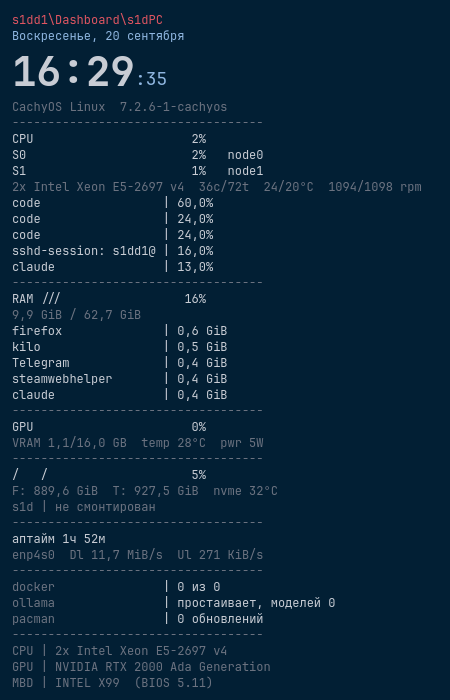

# plaintop

[English](README.md) · Русский

Текстовый монитор системы для рабочего стола KDE Plasma: моноширинный текст прямо на
обоях — полоски нагрузки из слешей, топ процессов, никаких рамок и скруглений.

Внешний вид — от Rainmeter-скина
[PlainExt](https://vsthemes.org/en/skins/rainmeter/41409-plainext.html); название — «plain»
оттуда плюс «top» от `htop`/`btop`.



## Что показывает

Часы, дату, систему и ядро, загрузку CPU общую и по узлам NUMA, модель процессора с
температурами по узлам и оборотами вентиляторов, топ процессов по CPU и по памяти, ОЗУ,
GPU с VRAM, температурой и потреблением, файловые системы с температурой NVMe, аптайм,
скорость сети, состояние docker / ollama / ожидающих обновлений и статичный паспорт
железа.

Что из этого показано, в каком порядке и с какими параметрами — **данные, а не код**,
см. [Три слоя](#три-слоя).

## Состояние

Собрано и используется на одной машине: CachyOS, Plasma 6.7.5, KWin на Wayland. Должно
работать на любом рабочем столе Plasma 6, но ничего другого не проверялось — сообщения
о результатах приветствуются.

Что лежит в репозитории:

| Каталог | Что это | Состояние |
|---|---|---|
| **`monitor/`** | текстовый монитор: хост-плазмоид, оконный хост со сквозными кликами и общий для них рендерер | работает |
| **`spectrum/`** | визуализатор звука: виджет плюс служба-реле, отдающая полосы cava | работает |
| **`conky/`** | первая реализация на [conky](https://github.com/brndnmtthws/conky) | погашена, живёт до полной замены |

⚠️ **Про мышь.** Плазмоид отдаёт правую кнопку и никогда не отдаёт левую — четыре обхода
проверены и провалились, см. [docs/GOTCHAS.ru.md](docs/GOTCHAS.ru.md). Поэтому у обоих
виджетов есть **оконный хост**: обычное окно с `Qt.WindowTransparentForInput`, через
которое проходит любой клик. Именно он и работает на столе автора. Платит он штатным
диалогом настроек и требует правила KWin на место — под Wayland окно не может разместить
себя само.

Почему сменился движок — [docs/DECISIONS.ru.md](docs/DECISIONS.ru.md).

## Установка

**Из KDE Store** — монитор плазмоидом, без репозитория:
[store.kde.org/p/2372814](https://store.kde.org/p/2372814/), или в Plasma «Добавить
виджеты… → Загрузить новые виджеты… → Загрузить виджеты Plasma...» и поиск `plaintop`.

**Из репозитория** — оба виджета, оконные хосты со сквозными кликами и реле:

```bash
git clone https://github.com/highscrren-dotcom/plaintop.git
cd plaintop
./install.sh --plasmoid          # монитор плазмоидом: сгенерировать, поставить, перезапустить оболочку
./install.sh --plaintop-window   # …или окном со сквозными кликами и своим редактором
./install.sh --spectrum          # визуализатор звука: плазмоид + служба реле
./install.sh --spectrum-window   # …и его окно со сквозными кликами
./install.sh --status            # что установлено и что работает
```

На столе нужен один хост на виджет — рисуют они одно и то же. Плазмоид раскладывается в
`~/.local/share/plasma/plasmoids/org.s1dd1.plaintop/`; установщик сажает его на стол,
если у этого виджета не настроено окно, а «Добавить виджеты» работает как обычно.
`./install.sh --pack` собирает те же пакеты файлами `.plasmoid` в `dist/` — для KDE Store
или релиза.

⚠️ `--plasmoid` перезапускает `plasmashell` намеренно: оболочка держит QML пакета в кэше,
и без перезапуска правка молча не доезжает. Это и ещё десяток ловушек —
в [docs/GOTCHAS.ru.md](docs/GOTCHAS.ru.md).

У реализации на conky свои ключи: `./install.sh` раскладывает и запускает её,
`--conky-files` раскладывает не запуская (нужно, пока она погашена),
`--conky-off` и `--conky-on` гасят и возвращают.

**Нужно:** Plasma 6 с `ksystemstats` (идёт в составе Plasma) и KDE Frameworks 6.23 или
новее (ради `KI18nContext`, решение 7), `python3` для генератора, скриптов установки и
реле, `msgfmt` из gettext для переводов, `qml6` (qt6-declarative) для оконных хостов,
моноширинный шрифт — по умолчанию `JetBrainsMono Nerd Font Mono`. Визуализатору
дополнительно нужна `cava`, реализации на conky — `conky`, `python-xlib` и `lm_sensors`.

## Под своё железо

Ничего от машины автора в раскладку не зашито. Значения, зависящие от железа, находятся на
той машине, где виджет запущен:

| Что | Как выбирается | Где менять |
|---|---|---|
| Сетевой интерфейс | из подключённых аппаратных интерфейсов: тот, что со шлюзом, затем тот, что прокачал больше трафика | редактор → «Блоки» → «Сеть», меню найденных интерфейсов |
| Датчики вентиляторов и NVMe | по шаблону среди датчиков, которые отдаёт машина | редактор → «Блоки» → «Процессор» / «Диски», список с поиском и живыми значениями |
| Точки монтирования | только `/` — точка монтирования это выбор, её не угадать | редактор → «Блоки» → «Диски», список смонтированного сейчас |
| Текст заголовка | пишете сами; по умолчанию пуст, и виден только хост | редактор → «Блоки» → «Заголовок» |

Выбранное вами значение хранится как предпочтение: пока машина его отдаёт, оно побеждает;
когда перезагрузка переименует чип или интерфейс, виджет не замолкает, а находит замену
сам. Почему так — решение 6 в `docs/DECISIONS.ru.md`.

⚠️ Если когда-нибудь впишете идентификатор датчика руками — чипы `lm_sensors` адресуются
**по имени** (`nct6779-isa-0a20`), а не по индексу `hwmon`: индексы плавают между
перезагрузками.

## Визуализатор звука

`spectrum/` рисует спектр того, что играет: кольцо, дугу или линию из штрихов, в том же
плоском стиле. Спектр считает `cava`, небольшая пользовательская служба systemd отдаёт её
полосы по локальному HTTP, а виджет двигает готовые прямоугольники — видеокарта держится
на половине процента, потому что покадрово ничего не растеризуется.

У одного и того же рендерера **два хоста**. У плазмоида есть штатный диалог Plasma; у
оконного (`Qt.WindowTransparentForInput`) клики проходят насквозь, и к нему идёт свой
редактор с живым просмотром. Подробности, настройки и измеренная цена:
**[spectrum/README.ru.md](spectrum/README.ru.md)**.

## Три слоя

```
schema/widget.json  ─┐                                  ┌─ диалог настроек правит его
                     ├─ генератор ─→ движок (QML)       │
schema/blocks.json  ─┘                                  └─ либо правьте JSON напрямую
```

- **Описание** — `schema/widget.json`: какие блоки, в каком порядке, с какими
  параметрами. Говорит, *что* показывать, а не *как это записать*, поэтому от движка
  не зависит.
- **Словарь** — `schema/blocks.json`: типы блоков и параметры, которые каждый принимает.
  Диалог настроек строится по нему, поэтому новый тип блока не требует кода интерфейса.
- **Генератор** — `monitor/generate.py`: проверяет описание и превращает его в JS-модуль
  внутри пакета. Негодное описание останавливает установку, а не даёт пустой виджет.

Подробности — [schema/README.ru.md](schema/README.ru.md).

## Настройки

Правый клик по виджету → «Настроить plaintop». Две страницы:

- **«Общее»** — шрифт, кегль, отступ от края, размер виджета, четыре цвета палитры, мышь,
  интервал обновления, как часто читать список процессов.
- **«Блоки»** — включить, выключить, переставить, поправить параметры, добавить блок
  любого типа из словаря, убрать.

У оконных хостов диалога Plasma нет; у каждого свой редактор с живым просмотром настоящим
движком — пункты меню «plaintop — настройки монитора» и «plainspectrum — настройки» или
`./install.sh --plaintop-settings` / `--spectrum-settings`.

**Про мышь.** Сразу после установки плазмоид ловит клики, как любой виджет, так что
правый клик ведёт в его настройки. Настройка «Мышь» — и стоящие за ней ключи
`./install.sh --clicks-on` / `--clicks-off` — снимает приём ввода у представления виджета.
Правой кнопке этого достаточно: она проходит сквозь виджет на стол. Левой — никогда, её
обёртка апплета держит за собой. Все четыре попытки и их итоги перечислены в
`docs/GOTCHAS.ru.md`.

Два типа блоков намеренно открытые:

- **`command`** — строка (или несколько) из вывода любой команды, со своим интервалом;
- **`sensor`** — любой датчик `ksystemstats` по его id, с полоской или без.

Поэтому новая величина — обычно новая строка в описании, а не заплатка в коде.

## Языки

Оба виджета, их редакторы и пункты меню говорят на языке Plasma («Параметры системы →
Язык и регион»); даты и десятичный разделитель следуют её «Форматам». Языков десять:
английский, русский, украинский, немецкий, французский, испанский, португальский
(Бразилия), польский, китайский (упрощённый) и японский. Всё, кроме английского и
русского, — машинный перевод: исправления принимаются пул-реквестами, а новый язык — одна
команда, см. [CONTRIBUTING.ru.md → Переводы](CONTRIBUTING.ru.md#переводы).

## Форкайте, ломайте, присылайте обратно

Это личная панель, которая оказалась приличной отправной точкой для всех, кому нужен
текст на рабочем столе Plasma. **Форкайте и делайте своим** — устройство выбрано так,
чтобы большинство правок были данными:

- **Свои строки** — блок `command` или `sensor` в настройках. Без сборки.
- **Новый тип блока** — одна запись в `schema/blocks.json` плюс один `case` в
  `monitor/shared/MonitorData.qml`. Обе страницы настроек подхватят его сами.
- **Другой движок** — слой описания намеренно не зависит от движка. Генератор для waybar,
  eww, AGS или обратно для conky не трогает описание.
- **Другая машина** — другие датчики, другой дистрибутив, другое всё: если значения по
  умолчанию мешают, это ошибка, о которой стоит сообщить.

Пул-реквесты и issue одинаково приветствуются — как и форк, который никогда не вернётся:
для этого и лицензия. Сначала прочитайте [CONTRIBUTING.ru.md](CONTRIBUTING.ru.md) —
он короткий и почти целиком про одно правило: **утверждение о поведении подтверждается
запуском, а не чтением документации.**

## Почему всё устроено именно так

Под KDE на Wayland почти каждый очевидный ответ оказывается неверным. Два документа,
без которых остальной код читается плохо:

- **[docs/GOTCHAS.ru.md](docs/GOTCHAS.ru.md)** — грабли, стоившие реального времени:
  тип окна и прозрачность у conky, клики сквозь виджет, кэш QML, размер и место апплета,
  почему `XMLHttpRequest` к `file://` внутри `plasmashell` запрещён. Каждая строка
  подтверждена запуском.
- **[docs/DECISIONS.ru.md](docs/DECISIONS.ru.md)** — решения с обоснованием, ценой и
  условием пересмотра.

## Как ведётся проект

Состояние передаётся между сессиями двумя файлами: **[STATE.md](STATE.md)** — где проект
и какой следующий шаг; **[docs/JOURNAL.md](docs/JOURNAL.md)** — как сюда пришли, по записи
на сессию, включая неудачи. Сам метод — [docs/WORKFLOW.ru.md](docs/WORKFLOW.ru.md).

Эти три файла по-русски: это рабочий журнал, переводить журнал — занятие впустую.
Всё, что нужно участнику, есть по-английски.

## Лицензия

[GPL-2.0-or-later](LICENSE) — та же, что заявлена в `metadata.json` плазмоида.
